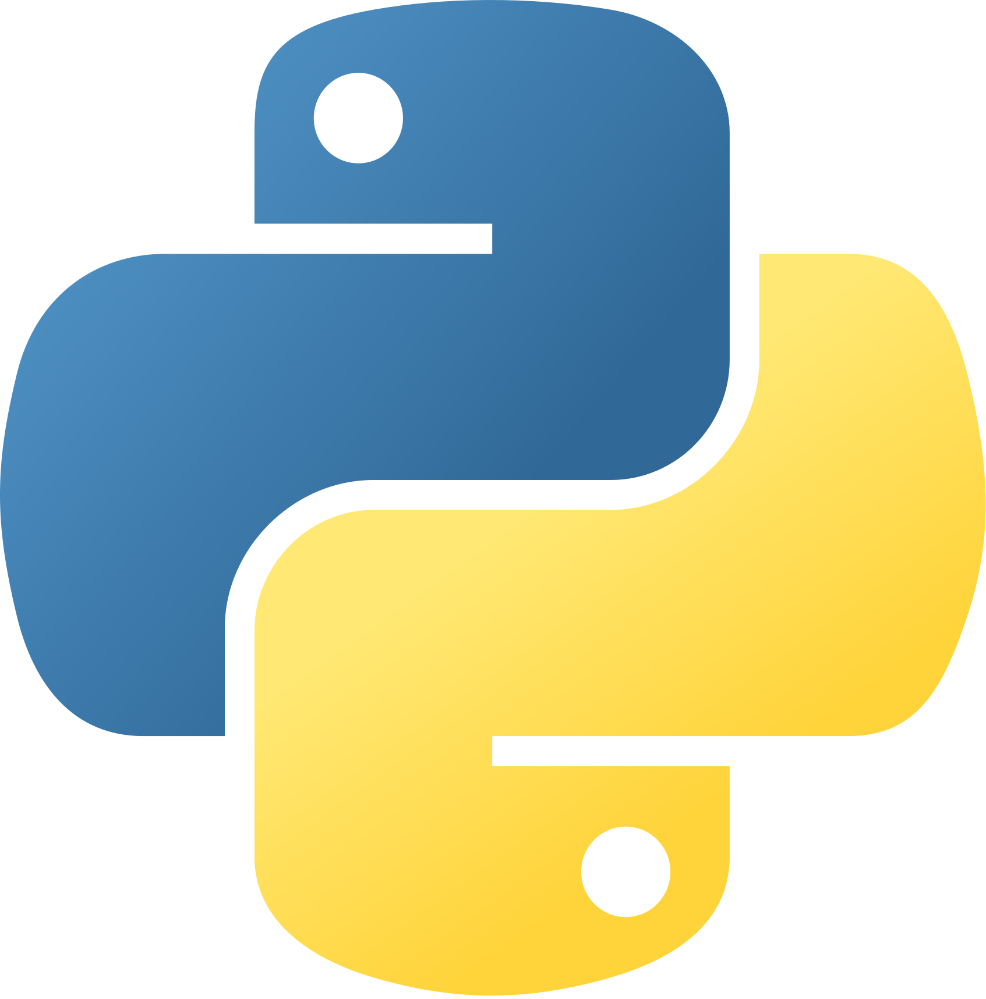
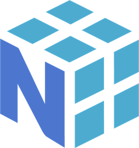
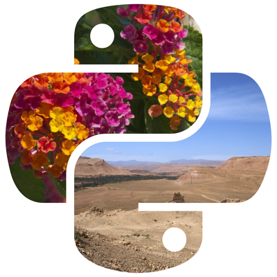
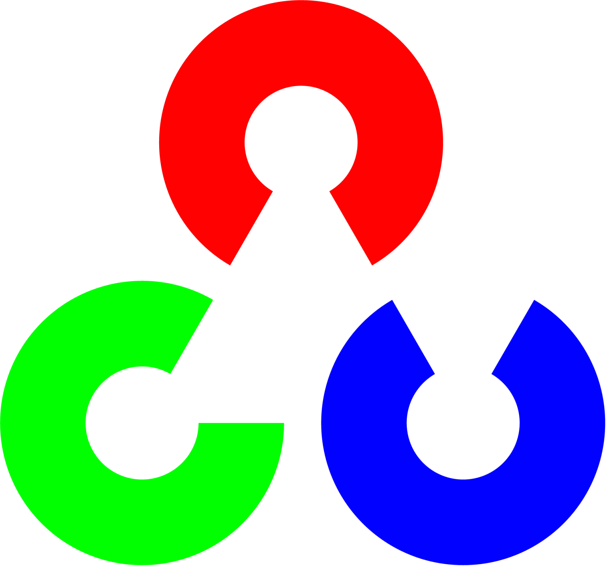
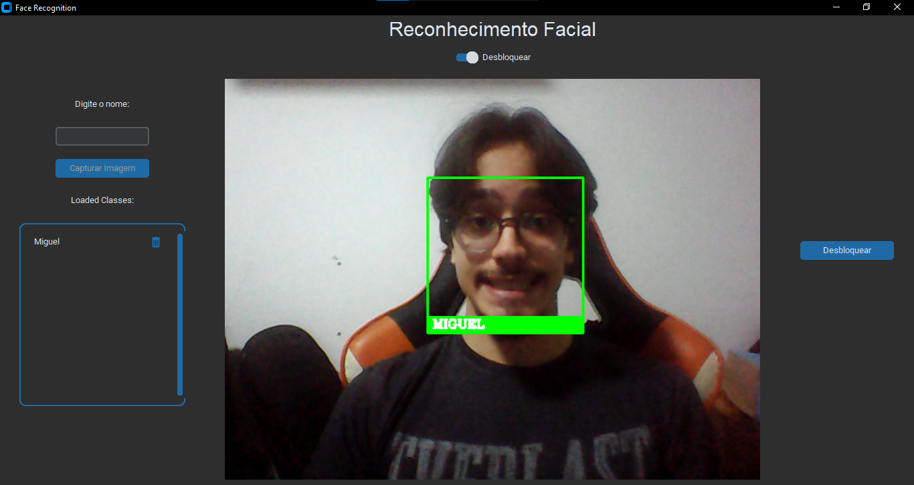
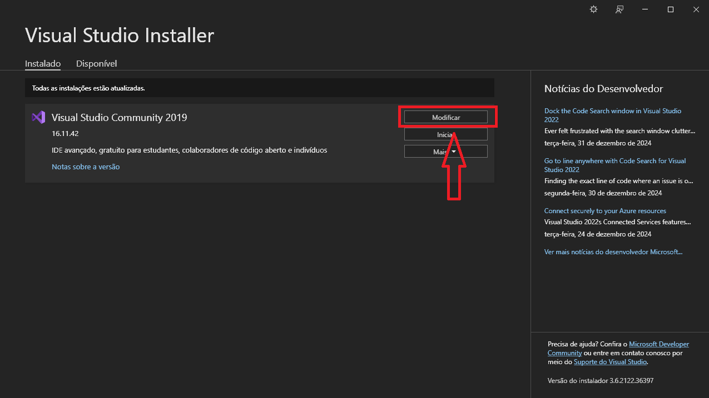
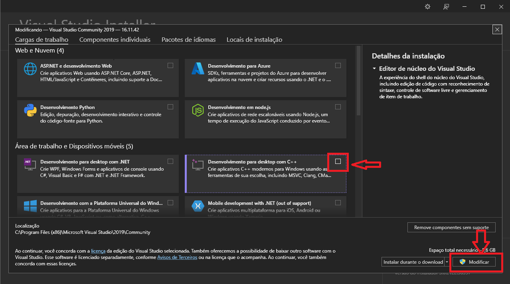

# Reconhecimento Facial

<div align="center">

Olá! &nbsp;

Bem vindo ao meu projeto!

Aqui eu exploro um pouco sobre sistemas de reconhecimento facial e interfaces.

Confira as tecnologias utilizadas abaixo!

</div>

<br><br>

## ⚙️ Tech Stack

<div align="center">

 <br>
 &nbsp;
 <br>
 &nbsp;
 &nbsp;


</div>

<br><br>

## 🖱️ Interface



A interface foi criada com Custom Tkinter e usa as imagens em tempo real da webcam. Há um switch para mudar entre o modo de "Capturar Imagem", para criar os encodings do rosto e um modo "Desbloquear", onde o sistema desenha uma bounding box em volta dos rostos detectados com legendas para as respectivas classes. 

Para criar uma classe, basta digitar o nome e capturar a imagem. Para testar o sistema, mude para o modo "Desbloquear" e clique no botão à direita para ver uma mensagem de confirmação!

<br><br>

## 📚 Explicação teórica
<br>

<div align="center">

### 🔢 Encodings

</div>

<br>

Encodings são representações numéricas que descrevem as características únicas de um rosto. Essas representações são vetores de números que formam a "impressão digital" do rosto, permitindo que seja eficientemente diferenciado de outros.

Para extrair características, são usadas redes neurais, que detectam traços e nuâncias importantes como distância entre os olhos, formato do nariz, da mandíbula, do rosto, etc.

Para comparar dois rostos, o sistema calcula a distância entre os encodings dos rostos, se a distância for menor que um limiar definido, os rostos serão considerados uma correspondência.

<br>

<div align="center">

### 🔍 face-recognition

</div>

<br>

Essa biblioteca usa a biblioteca de aprendizado de máquina e visão computacional dlib para realizar as operações de processamento facial. Ela abstrai da dlib para deixa-la mais fácil de usar para resolver tarefas complexas de reconhecimento de faces.

<br>

<div align="center">

### 📦 dlib

</div>

<br>

A dlib é uma biblioteca renomada pela precisão e desempenho em tarefas de visão computacional, incluindo reconhecimento facial.

Para detecção de rostos, ela utiliza o método HOG (Histograma de Gradientes Orientados) combinado com um classificador linear, analisando contornos, gradientes e texturas para identificar rostos em uma imagem.

Além disso, a dlib conta com um modelo pré-treinado que detecta 68 pontos-chave faciais, como os cantos dos olhos, bordas do nariz e contornos dos lábios, que são cruciais para o alinhamento e análise facial.

Após a detecção, a dlib utiliza uma Rede Neural ResNet-34 para gerar encodings faciais: vetores numéricos de 128 dimensões que capturam as características únicas de cada rosto, permitindo comparações precisas.

<br>

<div align="center">

### 👁️‍🗨️ Computer Vision (cv2)

</div>

<br>

A biblioteca OpenCV (Open Source Computer Vision Library) é uma das mais populares para aplicações de visão computacional. Ela permite processar imagens e vídeos, oferecendo ferramentas para tarefas como detecção de objetos, manipulação de imagens e análise de padrões.

O OpenCV funciona em conjunto com outras bibliotecas, fornecendo a base para operações de processamento de imagens antes de aplicar algoritmos mais específicos, como o reconhecimento facial.

<br>

<div align="center">

### 🖥️🎨 Custom Tkinter

</div>

<br>

O CustomTkinter é uma biblioteca que estende a funcionalidade do Tkinter, oferecendo widgets mais modernos e personalizáveis para criar interfaces gráficas no Python.

<br>

<div align="center">

### 🧵 Threading

</div>

<br>

A biblioteca threading do Python é usada para criar e gerenciar threads, que são sequências independentes de execução dentro de um programa. Threads permitem que diferentes partes de um programa sejam executadas simultaneamente, o que é útil para melhorar a responsividade de aplicações e interfaces.

<br><br>

## 🛠️ Como instalar

Você pode clonar este repositório com o seguinte comando:

```
git clone https://github.com/miguel-mb-cell/Reconhecimento-Facial.git
```
<br>

Para poder usar a biblioteca dlib, mencionada acima, é necessário instalar o pacote “Desenvolvimento para desktop com C++” no Visual Studio.

Para isso, abra seu Visual Studio Installer, encontre a versão que você está usando e clique em "Modificar"



Agora, selecione o pacote “Desktop development with C++” e clique em "Modificar"



Agora instale as seguintes bibliotecas:

```
pip install opencv-python opencv_contrib-python
pip install face-recognition
pip install numpy
pip install customtkinter
pip install Pillow
```

Pronto! O programa deve rodar a interface aparecerá na tela!

<br>

## Referências

[Facial Recognition — a visual step by step](https://medium.com/swlh/facial-recognition-a-visual-step-by-step-d679289bab11)

[Building Real-Time Face Recognition with Python](https://medium.com/@suditi/building-real-time-face-recognition-with-python-b0584900d631)
